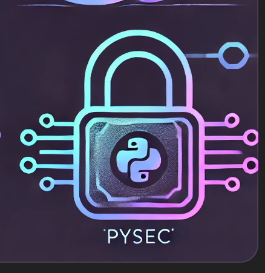

[](https://badge.fury.io/py/tensorflow)[](https://badge.fury.io/py/tensorflow)[](https://bestpractices.coreinfrastructure.org/projects/1486)[](https://discord.gg/nthXNEv)

## Welcome to PySec

[PySec](https://www.google.com) is an easy-to-use open-source framework designed for privacy-preserving data intelligence and machine learning. PySec enables secure computations while preserving data confidentiality through the use of homomorphic encryption (HE), GPU parallelism, FPGA acceleration, and customizable modular templates. It supports a variety of privacy-preserving tasks, such as encrypted inference, logistic regression (LR), private information retrieval (PIR), and more.

## Install

To install PySec, simply use the following pip command:

```bash
pip install pysec
```

Ensure that you have Python 3.9 or above.


## Core Concepts

- **Cryptographic Layers**: PySec abstracts cryptographic operations into three distinct layers:

1. **Primitives**: Low-level cryptographic operations for encryption, decryption, and homomorphic operations.
2. **Expressions**: Intermediate operations that simplify cryptographic tasks and offer more advanced functionality.
3. **Templates**: High-level modular templates that enable easy integration into machine learning workflows.

- **Hardware Acceleration**: PySec utilizes GPU and FPGA acceleration to optimize the speed and efficiency of privacy-preserving computations.

## API Reference

#### Cryptographic Primitives

`pysec.encrypt(data: Union[str, bytes], key: Union[str, bytes]) -> bytes`

Encrypts the given data using the specified encryption key.

- **Parameters**:
  - `data` (Union[str, bytes]): The data to encrypt.
  - `key` (Union[str, bytes]): The encryption key.
- **Returns**: Encrypted data as bytes.

`pysec.decrypt(data: bytes, key: Union[str, bytes]) -> Union[str, bytes]`

Decrypts the given encrypted data using the specified key.

- **Parameters**:
  - `data` (bytes): The encrypted data.
  - `key` (Union[str, bytes]): The decryption key.
- **Returns**: Decrypted data, either as a string or bytes.

---

#### Machine Learning Models

`pysec.models.LogisticRegressionModel(input_size: int, output_size: int, activation: str = 'sigmoid') -> LogisticRegression`

Creates a privacy-preserving logistic regression model.

- **Parameters**:
  - `input_size` (int): Number of input features.
  - `output_size` (int): Number of output classes.
  - `activation` (str, default = 'sigmoid'): Activation function to use for the model.
- **Returns**: A logistic regression model instance.

##### Example:

```python
model = pysec.models.LogisticRegressionModel(input_size=10, output_size=1)
```

`pysec.models.ResNet20(input_shape: Tuple[int, int, int], num_classes: int) -> ResNet`

Creates a privacy-preserving ResNet-20 model for image recognition.

- **Parameters**:
  - `input_shape` (Tuple[int, int, int]): The shape of input images (height, width, channels).
  - `num_classes` (int): The number of output classes.
- **Returns**: A ResNet-20 model instance.

---

#### Private Information Retrieval (PIR)

`pysec.pir.IndexPIR(query: str, index: str, config: Dict[str, Any]) -> str`

Performs a private information retrieval query using indexing techniques.

- **Parameters**:
  - `query` (str): The search query.
  - `index` (str): The indexed database.
  - `config` (Dict[str, Any]): Configuration settings for the retrieval process.
- **Returns**: The retrieved data as a string.

`pysec.pir.KeywordPIR(query: str, index: str, keywords: List[str]) -> List[str]`

Executes a privacy-preserving keyword-based search in a database.

- **Parameters**:
  - `query` (str): The keyword search query.
  - `index` (str): The indexed database.
  - `keywords` (List[str]): List of keywords to search for.
- **Returns**: A list of matching results.

---

#### Hardware Acceleration

`pysec.acceleration.enable_gpu(enable: bool = True)`

Enables or disables GPU acceleration.

- Parameters:
  - `enable` (bool, default = True): Whether to enable GPU acceleration.

`pysec.acceleration.enable_fpga(enable: bool = True)`

Enables or disables FPGA acceleration.

- Parameters:
  - `enable` (bool, default = True): Whether to enable FPGA acceleration.

---

#### Example Usage

```python
import pysec

# Enable GPU acceleration
pysec.acceleration.enable_gpu()

# Create a privacy-preserving Logistic Regression model
model = pysec.models.LogisticRegressionModel(input_size=10, output_size=1)

# Encrypt data
data = "Confidential information"
encrypted_data = pysec.encrypt(data, key="secret_key")

# Decrypt data
decrypted_data = pysec.decrypt(encrypted_data, key="secret_key")

# Run a PIR query
result = pysec.pir.IndexPIR(query="search_term", index="index_name", config={"param": "value"})

# Output result
print(f"Decrypted data: {decrypted_data}")
print(f"PIR query result: {result}")
```

## More Examples

Explore the diverse privacy-preserving computation tasks enabled by PySec.  Designed for encrypted inference, logistic regression (LR), private information retrieval (PIR), and other advanced applications based on homomorphic encryption (HE), PySec empowers you to perform secure computations while keeping data confidential.

| Task                                                         | Description                                                  | Run                                                          |
| ------------------------------------------------------------ | ------------------------------------------------------------ | ------------------------------------------------------------ |
| [Hello world](#hello-simple-model)                           | PySec- Hello world example                                   | <a target="_blank" href="https://lightning.ai/lightning-ai/studios/pytorch-lightning-hello-world"></a> |
| [CryptoCNN](https://lightning.ai/lightning-ai/studios/image-classification-with-pytorch-lightning) | Cryptocurrency prediction using Convolutional Neural Networks. | <a target="_blank" href="https://lightning.ai/lightning-ai/studios/image-classification-with-pytorch-lightning"></a> |
| [CryptoGCN](https://lightning.ai/lightning-ai/studios/image-segmentation-with-pytorch-lightning) | Graph-based neural network for cryptocurrency analysis.      | <a target="_blank" href="https://lightning.ai/lightning-ai/studios/image-segmentation-with-pytorch-lightning"></a> |
| [Privacy-protection LR](https://lightning.ai/lightning-ai/studios/object-detection-with-pytorch-lightning) | Privacy-preserving logistic regression models.               | <a target="_blank" href="https://lightning.ai/lightning-ai/studios/object-detection-with-pytorch-lightning"></a> |
| [Privacy-protection ResNet-20](https://lightning.ai/lightning-ai/studios/text-classification-with-pytorch-lightning) | Privacy-preserving ResNet model for image recognition.       | <a target="_blank" href="https://lightning.ai/lightning-ai/studios/text-classification-with-pytorch-lightning"></a> |
| [Index PIR](https://lightning.ai/lightning-ai/studios/text-summarization-with-pytorch-lightning) | Private Information Retrieval using indexing techniques.     | <a target="_blank" href="https://lightning.ai/lightning-ai/studios/text-summarization-with-pytorch-lightning"></a> |
| [Keyword PIR](https://lightning.ai/lightning-ai/studios/finetune-a-personal-ai-music-generator) | Privacy-preserving keyword-based search in databases.        | <a target="_blank" href="https://lightning.ai/lightning-ai/studios/finetune-a-personal-ai-music-generator"></a> |
|                                                              |                                                              | <a target="_blank" href="https://lightning.ai/lightning-ai/studios/finetune-an-llm-with-pytorch-lightning"></a> |
|                                                              |                                                              | <a target="_blank" href="https://lightning.ai/lightning-ai/studios/recommendation-system-with-pytorch-lightning"></a> |
|                                                              |                                                              | <a target="_blank" href="https://lightning.ai/lightning-ai/studios/time-series-forecasting-with-pytorch-lightning"></a> |
## The Team

PySec is currently maintained by [A](), [B](), and [C]() with major contributions coming from hundreds of talented individuals in various forms and means. A non-exhaustive but growing list needs to mention: [D](), [E](), [F](), [G](), [H]().
## License

PySec is completely free and open-source and licensed under the [Apache License 2.0](LICENSE).
